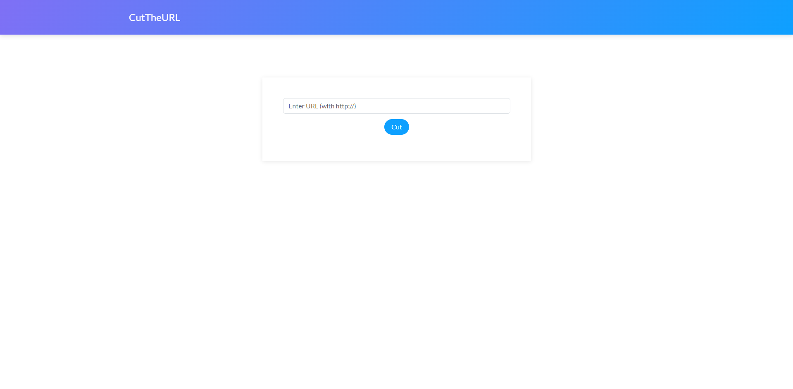

# CutTheURL: URL Shortner Web App

## Overview

CutTheURL is a URL shortener web application built with Python and Flask. It allows users to input long URLs and receive shorter, more manageable links that redirect to the original URLs. This application is ideal for sharing lengthy links in emails, social media posts, or anywhere else where shorter URLs are more convenient.



## Features

* Shorten long URLs to concise, easy-to-share links.
* Redirect short URLs to their original long URLs.
* Simple and efficient backend using Flask framework.

## Prerequisites

Before you begin, ensure you have met the following requirements:

* Python 3.x installed on your machine.
* `pip` package manager installed.

## Setup

#### Installation

1. **Clone the Repository**

   ```bash
   git clone https://github.com/Dharshan2004/cuttheurl.git
   cd cuttheurl
   ```
2. **Create and Activate a Virtual Environment**

   ```bash
   python -m venv venv
   source venv/bin/activate  # On Windows use `venv\Scripts\activate`
   ```
3. **Install Dependencies**

   ```bash
   pip install -r requirements.txt
   ```

#### Running the Application

1. Initialise the Database

   ```bash
   python create_db.py
   ```
2. Start the Development Server

   ```bash
   python app.py
   ```

   The application will be accessible at `http://127.0.0.1:5000`.

#### Usage

1. Open your web browser and navigate to `http://127.0.0.1:5000`.
2. Enter a long URL in the provided input field and click "Shorten".
3. Receive a shortened URL which you can use to redirect to the original long URL.

## Takeaways

#### 1. **Understanding Flask**

* Gain practical experience with the Flask web framework.
* Learn how to structure a Flask application, including creating routes, templates, and handling requests.

#### 2. **Working with Databases**

* Understand how to integrate a database with a Flask application.

#### 3. **Frontend and Backend Integration**

* Understand how to build a simple, user-friendly web interface with HTML and integrate it with the backend logic.
* Gain experience in using templates to dynamically generate HTML content.

## Extensions

#### **1. RESTful API**

* **✅ Create Endpoints:** Develop RESTful API endpoints for URL shortening and retrieval.
  * `POST /api/shorten`: Accepts a long URL and returns a shortened URL.
  * `GET /api/get/<short_code>`: Returns the original URL.
* **Authentication:** Implement token-based authentication (e.g., using JWT) to secure the API endpoints.
* **API Documentation:** Use Swagger or Postman to document your API.

#### 2. **Custom URLs**

* **Custom Short Codes:** Allow users to create custom short codes instead of automatically generated ones.
* **Validation:** Ensure that custom codes are unique and follow a specific format (e.g., alphanumeric).
* **UI Integration:** Update the web interface to allow users to input their desired short code.

#### 3. **User Accounts**

* **User Authentication:** Implement user registration and login functionality.
* **User-Specific URLs:** Allow users to manage their shortened URLs through a personal dashboard.
* **Password Protection:** Optionally protect shortened URLs with a password.

#### 4. **Analytics**

* **Click Tracking:** Track the number of times each shortened URL is accessed.
* **Dashboard:** Provide users with analytics on their shortened URLs, such as click counts and geographic distribution of clicks.
* **Integration:** Use tools like Google Analytics for advanced tracking and insights.
